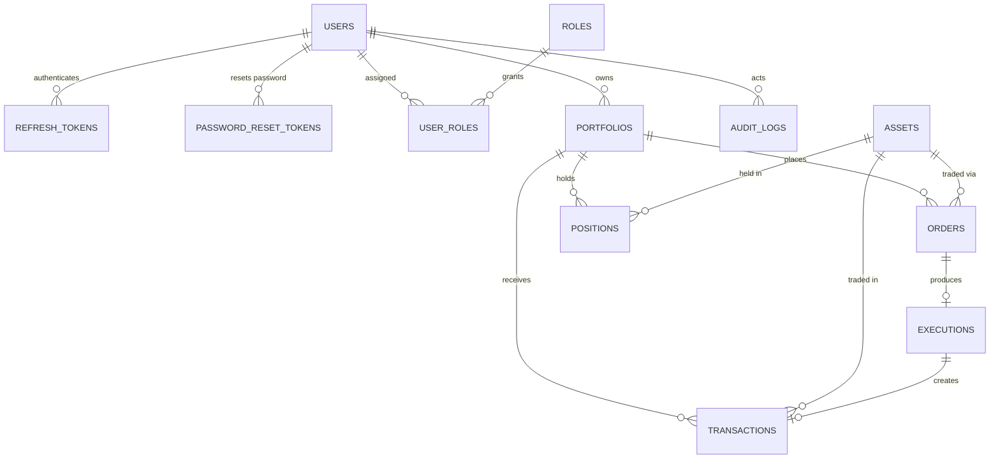

# Data Model

## 1. Purpose

This document defines the logical data model of the Financial Portfolio & Trading Operations Platform.

It describes the persistent entities, their key attributes, relationships, and lifecycle. It is derived from:

- `docs/01-product/requirements.md` — functional requirements.
- `docs/01-product/scope.md` — MVP boundaries.
- `docs/02-domain/domain-model.md` — domain entities and aggregates.
- `docs/02-domain/business-rules.md` — invariants the model must support.

Physical concerns (column types, indexes, concurrency tokens) are defined in `database-design.md`.

### Status Legend

- **Implemented** — exists in code today.
- **Planned** — required by the MVP; introduced in an upcoming phase.
- **Future** — deferred beyond the MVP; listed for evolution planning.

---

# 2. Model Overview

```text
Identity Module          Portfolio Module         Trading Module
├── Users                ├── Portfolios           ├── Orders
├── RefreshTokens        ├── Assets               ├── Executions
├── PasswordResetTokens  └── Positions            └── Transactions
├── Roles
└── UserRoles

Cross-Cutting
└── AuditLogs
```

Data flows through the trading workflow as follows:

```text
Order → Execution → Transaction → Position Update → Portfolio Valuation
```

---

# 3. Entity Catalog

| Entity | Purpose | Module | Phase | Status |
|---|---|---|---|---|
| User | Account holder (FR-001..003) | Identity | 1 | Implemented |
| RefreshToken | JWT refresh session (auth) | Identity | 1 | Implemented |
| PasswordResetToken | One-time password reset code | Identity | 1 | Implemented |
| Role | Named authorization role | Identity | 2+ | Planned |
| UserRole | Assignment of roles to users | Identity | 2+ | Planned |
| Portfolio | Investment container owned by a user (FR-004..006) | Portfolio | 2 | Planned |
| Asset | Tradable instrument with current price (FR-007..008) | Portfolio | 2 | Planned |
| Position | Quantity of one asset held by one portfolio (FR-009..010) | Portfolio | 2 | Planned |
| Order | Intent to buy or sell (FR-011..015) | Trading | 3 | Planned |
| Execution | Simulated execution result of an order (FR-016) | Trading | 3 | Planned |
| Transaction | Immutable financial fact from an execution (FR-018..019) | Trading | 3 | Planned |
| AuditLog | Append-only record of business/security events (FR-024) | Cross-cutting | 4 | Planned |

Future entities are listed in section 10.

---

# 4. Entity Definitions

All entities inherit the audit base attributes defined in `BaseEntity`:

| Attribute | Type | Description |
|---|---|---|
| Id | Guid | Primary key, generated client-side on construction. |
| CreatedAt | DateTime (UTC) | Creation timestamp. |
| CreatedBy | string? | Reserved for future audit attribution. |
| UpdatedAt | DateTime? | Last modification timestamp. |
| UpdatedBy | string? | Reserved for future audit attribution. |

---

## 4.1. User (Implemented)

Represents an account holder. Maps to the `User` domain entity.

| Attribute | Type | Description | Constraints |
|---|---|---|---|
| Id | Guid | PK | Inherited. |
| UserName | string | Login name. | Required, max 256. |
| Email | string | Contact + unique identity. | Required, max 256, stored lowercase, unique index. |
| PasswordHash | string | Hashed credential. | Required, max 512. Never store plain text. |
| FirstName | string? | Given name. | Max 128. |
| LastName | string? | Family name. | Max 128. |
| DisplayName | string? | Public display name. | Max 256. |
| PhoneNumber | string? | Contact number. | Max 32. |
| IsActive | bool | Soft enable/disable. Replaces a status enum. | Required, default true. Disabling blocks protected operations (BR-002). |

Notes:

- The domain document describes `Status`; today this is modeled as the boolean `IsActive`. A richer status enum is a possible future change.
- Users are disabled, never deleted, so dependent financial records always retain a valid owner reference.

## 4.2. RefreshToken (Implemented)

One row per issued refresh token; supports rotation and revocation.

| Attribute | Type | Description | Constraints |
|---|---|---|---|
| Id | Guid | PK | Inherited. |
| UserId | Guid | Owning user. | FK → Users.Id, indexed. |
| Token | string | Opaque token value. | Required, max 256, unique index. |
| ExpiresAt | DateTime (UTC) | Expiry time. | Required, must be in the future at creation. |
| RevokedAt | DateTime? (UTC) | Set on logout / rotation / revocation. | Null while active. |

Derived state (not persisted): active = `RevokedAt is null && now < ExpiresAt`.

## 4.3. PasswordResetToken (Implemented)

One-time password reset code (OTP style).

| Attribute | Type | Description | Constraints |
|---|---|---|---|
| Id | Guid | PK | Inherited. |
| UserId | Guid | Requesting user. | FK → Users.Id, indexed. |
| Code | string | Short numeric/alphanumeric code. | Required, max 16, indexed. |
| ExpiresAt | DateTime (UTC) | Expiry time. | Required. |
| UsedAt | DateTime? (UTC) | Set when consumed once. | Null until used. |

Derived state: active = not expired and not used. Issuing a new code invalidates prior codes for the same user.

## 4.4. Role (Planned)

Static named role supporting FR-003 and BR-037. Seeded values: `Investor`, `Administrator`.

| Attribute | Type | Description | Constraints |
|---|---|---|---|
| Id | Guid | PK | Inherited. |
| Name | string | Role name. | Required, max 64, unique. |

Fine-grained permissions are out of scope for the MVP (see section 10).

## 4.5. UserRole (Planned)

Assignment join between users and roles.

| Attribute | Type | Description | Constraints |
|---|---|---|---|
| UserId | Guid | Composite PK part. | FK → Users.Id. |
| RoleId | Guid | Composite PK part. | FK → Roles.Id. |
| AssignedAt | DateTime (UTC) | When the assignment was made. | Required. |

Every registered user receives the `Investor` role by default.

## 4.6. Portfolio (Planned)

Aggregate root for holdings, positions, orders, and valuation (FR-004..006, BR-003..005, BR-028..030).

| Attribute | Type | Description | Constraints |
|---|---|---|---|
| Id | Guid | PK | Inherited. |
| UserId | Guid | Owner. | FK → Users.Id, indexed. A portfolio belongs to exactly one user (BR-003). |
| Name | string | Human-readable name. | Required, max 128. Unique per user. |
| BaseCurrency | char(3) | ISO 4217 currency of valuations. | Default `USD`. Single currency in MVP. |
| Status | enum | `ACTIVE`, `DISABLED`. | Disabled portfolios reject new trading activity (BR-004). |
| Notes | string? | Free-text description. | Max 512. |

Valuation fields (current value, unrealized/realized P/L) are computed from positions and market prices, not persisted, per BR-028..030.

## 4.7. Asset (Planned)

Tradable instrument metadata plus the current simulated market price (FR-007..008, BR-006..007).

| Attribute | Type | Description | Constraints |
|---|---|---|---|
| Id | Guid | PK | Inherited. |
| Symbol | string | Normalized ticker, uppercase. | Required, max 16, unique. |
| Name | string | Full instrument name. | Required, max 256. |
| AssetType | enum | `STOCK`, `ETF` initially. | Required. Extensible per scope §3.3. |
| CurrentPrice | decimal | Latest simulated price used for valuation. | Required. |
| Currency | char(3) | Price currency. | Default `USD`. |
| PriceUpdatedAt | DateTime (UTC) | When CurrentPrice was last refreshed. | Required. |
| Status | enum | `ACTIVE`, `INACTIVE`. | Inactive assets cannot receive new orders (BR-007). |

Price history is intentionally not modeled in the MVP (see section 10).

## 4.8. Position (Planned)

Current holding of one asset within one portfolio (FR-009..010, BR-020..024). This is mutable derived state: it is recalculated from executed transactions but persisted for fast reads.

| Attribute | Type | Description | Constraints |
|---|---|---|---|
| Id | Guid | PK | Inherited. |
| PortfolioId | Guid | Owning portfolio. | FK → Portfolios.Id, indexed. |
| AssetId | Guid | Held asset. | FK → Assets.Id, indexed. |
| Quantity | decimal | Units held. | ≥ 0 for MVP long-only positions (BR-023). Zero means closed. |
| AverageEntryPrice | decimal? | Weighted average acquisition cost. | Null until first buy; consistent with remaining quantity (BR-024). |
| RealizedPnL | decimal | Accumulated realized profit/loss from sells. | Default 0. |

Constraints:

- One position per (PortfolioId, AssetId) pair — unique composite index (BR-020).
- Rows are created lazily on first buy and never deleted; a closed position remains as history.
- Updates only occur as part of the order-execution consistency boundary (FR-017, BR-031).

## 4.9. Order (Planned)

Investor intent to buy or sell, with full lifecycle state (FR-011..015, BR-008..015).

| Attribute | Type | Description | Constraints |
|---|---|---|---|
| Id | Guid | PK | Inherited. |
| PortfolioId | Guid | Ordering portfolio. | FK → Portfolios.Id, indexed. Must be active at creation (BR-009). |
| AssetId | Guid | Traded asset. | FK → Assets.Id. Must be active at creation (BR-010). |
| Side | enum | `BUY`, `SELL`. | Required. |
| OrderType | enum | `MARKET`, `LIMIT`. | Required. |
| Quantity | decimal | Requested units. | > 0 (BR-008). |
| LimitPrice | decimal? | Maximum (BUY) / minimum (SELL) acceptable price. | Required when LIMIT (BR-011); null for MARKET. |
| FilledQuantity | decimal | Accumulated executed units. | Default 0; ≤ Quantity (BR-017). Enables partial fills later. |
| Status | enum | `PENDING`, `PROCESSING`, `FILLED`, `REJECTED`, `CANCELLED`. | Transitions restricted to the state machine (BR-012). |
| RejectionReason | string? | Why execution failed. | Max 256; set when REJECTED. |
| CompletedAt | DateTime? (UTC) | Terminal transition time (fill/reject/cancel). | Null until terminal. Cancellation time for CANCELLED (FR-014). |

`CreatedAt` serves as placement time. Sell validation against available position quantity happens in the domain before persistence.

## 4.10. Execution (Planned)

Result of processing an eligible order by the simulated engine (FR-016..017, BR-016..019).

| Attribute | Type | Description | Constraints |
|---|---|---|---|
| Id | Guid | PK | Inherited. |
| OrderId | Guid | Executed order. | FK → Orders.Id, **unique** in MVP (one full-fill execution per order). |
| ExecutedQuantity | decimal | Units filled. | > 0 (BR-016), ≤ Order.Quantity (BR-017). |
| ExecutionPrice | decimal | Price applied by the simulation. | Required. |
| Fee | decimal | Commission charged. | Default 0; excluded from MVP P/L formulas (BR-030 note). |
| ExecutedAt | DateTime (UTC) | Execution timestamp. | Required. |

The unique index on `OrderId` doubles as the idempotency guard: a retried execution insert fails rather than duplicating financial effects (BR-019, US-017). Relaxing uniqueness enables partial fills in the future without schema redesign.

## 4.11. Transaction (Planned)

Immutable financial fact produced by a successful execution (FR-018..019, BR-025..027). Denormalized copies of portfolio/asset/side make rows self-contained for historical reporting.

| Attribute | Type | Description | Constraints |
|---|---|---|---|
| Id | Guid | PK | Inherited. |
| OrderId | Guid | Source order (BR-027). | FK → Orders.Id, indexed. |
| ExecutionId | Guid | Source execution. | FK → Executions.Id, unique in MVP (one transaction per execution — idempotency guard). |
| PortfolioId | Guid | Affected portfolio (copy). | FK → Portfolios.Id, indexed. |
| AssetId | Guid | Traded asset (copy). | FK → Assets.Id, indexed. |
| Side | enum | `BUY`, `SELL` (copy). | Required. |
| Quantity | decimal | Executed units (copy). | > 0. |
| Price | decimal | Execution price (copy). | Required. |
| GrossAmount | decimal | `Quantity × Price` at creation. | Stored snapshot, not recomputed. |
| Fee | decimal | Charged fee (copy). | Default 0. |
| ExecutedAt | DateTime (UTC) | Business timestamp (from execution). | Required. |

Rules:

- Rows are append-only; corrections happen via compensating entries, never updates or deletes (BR-026).
- Filterable history (asset, type, date range per FR-019) is supported by the indexes listed in `database-design.md`.

## 4.12. AuditLog (Planned)

Append-only record of business and security events (FR-024, US-013, US-016).

| Attribute | Type | Description | Constraints |
|---|---|---|---|
| Id | bigint | Monotonic identity PK (append-heavy table; no need for GUIDs). | Generated by database. |
| ActorUserId | Guid? | Who performed the action. | Nullable for system events; FK → Users.Id. |
| Action | string | Event name (e.g. `ORDER_CREATED`). | Required, max 64. |
| EntityType | string? | Resource type affected (e.g. `Order`). | Max 64. |
| EntityId | string? | Resource identifier. | Max 64; string because resources vary. |
| OccurredAt | DateTime (UTC) | When it happened. | Required, default now. |
| IpAddress | string? | Client address where relevant. | Max 45 (IPv6). |
| Details | jsonb? | Structured event payload. | Optional. |

Audited actions map directly to FR-024: registration, authentication, portfolio changes, order creation/cancellation/execution, transaction creation, position updates. Rows are never updated or deleted through normal application operations.

---

# 5. Enumerations

Stored as text in the database (rationale in `database-design.md`); validated by the domain layer.

| Enum | Values | Used By |
|---|---|---|
| PortfolioStatus | ACTIVE, DISABLED | Portfolio |
| AssetType | STOCK, ETF | Asset |
| AssetStatus | ACTIVE, INACTIVE | Asset |
| OrderSide | BUY, SELL | Order, Transaction |
| OrderType | MARKET, LIMIT | Order |
| OrderStatus | PENDING, PROCESSING, FILLED, REJECTED, CANCELLED | Order |

User status is currently the boolean `IsActive`; Role has no status.

---

# 6. Relationships and Cardinality



Cardinality summary (parent → child):

| Relationship | Cardinality | On delete |
|---|---|---|
| User → Portfolio | 1 : many | Restrict |
| Portfolio → Order | 1 : many | Restrict |
| Portfolio → Position | 1 : many | Restrict |
| Asset → Order / Position / Transaction | 1 : many | Restrict |
| Order → Execution | 1 : zero-or-one (MVP) | Restrict |
| Order → Transaction | 1 : many (one in MVP) | Restrict |
| Execution → Transaction | 1 : zero-or-one | Restrict |
| User → Role | many : many via UserRole | Cascade join rows only |

Delete behavior: financial records are never removed, so all foreign keys use restrict semantics. Users are deactivated instead of deleted. No cascade chains cross module boundaries.

---

# 7. Aggregates and Write Ownership

Consistent with `docs/02-domain/domain-model.md`:

```text
Portfolio Aggregate              Order Aggregate              Identity Aggregates
────────────────────             ────────────────             ───────────────────
Portfolios (root)                Orders (root)                Users (root)
Positions (child rows)           Executions (result)          RefreshTokens
                                                              PasswordResetTokens

Transactions = immutable event log written by the execution flow, owned by no aggregate.
AuditLogs     = immutable cross-cutting log written alongside business operations.
```

Implications:

- Positions are only mutated inside their aggregate's execution flow (order fill), keeping BR-031 enforceable in one consistency boundary.
- Orders never modify other aggregates directly; downstream effects are applied by the application-layer execution workflow in a single unit of work.

---

# 8. Data Classification and Lifecycle

| Class | Entities | Rules |
|---|---|---|
| Mutable state | Users, Portfolios, Assets, Positions, Orders | Updated via domain behavior methods; optimistic concurrency enforced (FR-028). |
| Derived state | Positions | Recomputed from executions; must stay consistent with transactions (FR-017). |
| Computed, not stored | Portfolio value, unrealized/realized P/L | Calculated on read from positions × asset prices (BR-028..030). |
| Immutable facts | Transactions, Executions, AuditLogs | Insert-only; no update/delete through application paths (BR-026, US-016). |
| Volatile reference data | Asset.CurrentPrice | Periodically refreshed by the replaceable market-data source (FR-022..023). |
| Security-sensitive | PasswordHash, Tokens, Codes | Hashed/opaque; never logged or exposed (NFR-001). |

Retention: no purge policy in the MVP; growth management (partitioning, archival) is deferred to the performance phase.

---

# 9. Requirement Traceability

| Requirement | Tables Involved |
|---|---|
| FR-001..002 Registration/Auth | Users, RefreshTokens, PasswordResetTokens |
| FR-003 Authorization | Users, Roles, UserRoles |
| FR-004..006 Portfolio CRUD | Portfolios |
| FR-007..008 Assets | Assets |
| FR-009..010 Positions | Positions, Transactions (source of truth for updates) |
| FR-011..015 Orders | Orders (+ Portfolios, Assets for validation) |
| FR-016..017 Execution | Orders, Executions, Transactions, Positions |
| FR-018..019 Transactions | Transactions |
| FR-020..021 Performance | Positions, Assets (read-only computation) |
| FR-022..023 Market data | Assets.CurrentPrice, PriceUpdatedAt |
| FR-024 Audit | AuditLogs |
| FR-025 Administration | Users, Roles, UserRoles, AuditLogs |
| FR-027..029 Integrity | Constraints and unique guards across Orders, Executions, Transactions, Positions |

---

# 10. Evolution (Future Entities)

Introduced only when a real requirement appears, per the scope-change rules:

| Entity | Purpose | Trigger |
|---|---|---|
| AssetPriceHistory | Time-series of prices per asset | Historical charts, backtesting (scope §9) |
| Permission / RolePermission | Fine-grained authorization matrix | When two-role RBAC stops being sufficient (FR-003) |
| OutboxMessage | Transactional outbox for integration events | Phase 6 asynchronous processing (scope §8) |
| ProcessedMessage (inbox) | Consumer-side idempotency for events | Phase 6 message-driven processing |
| CashAccount / CashLedger | Portfolio cash balances | If cash enters the valuation model (BR-029 note) |
| Watchlist / WatchlistItem | User asset tracking | Post-MVP product features |

Schema changes follow the process in `docs/02-domain/business-rules.md` §13: documentation, domain model, tests, and migrations move together.
